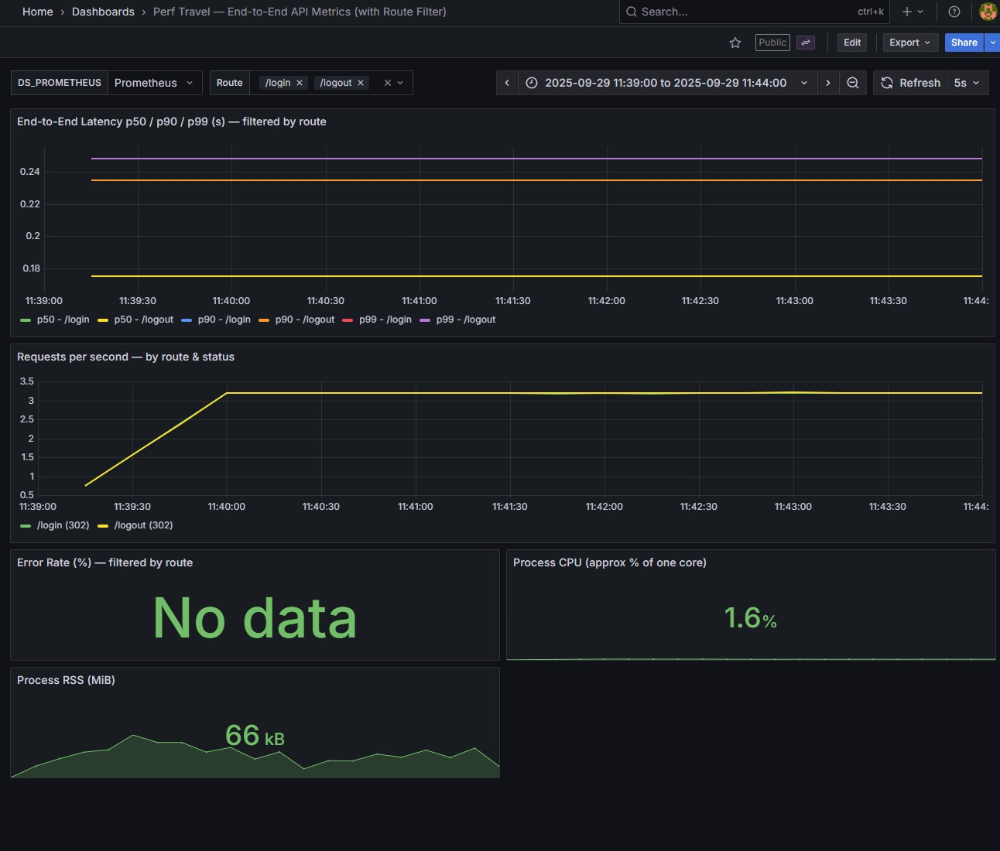
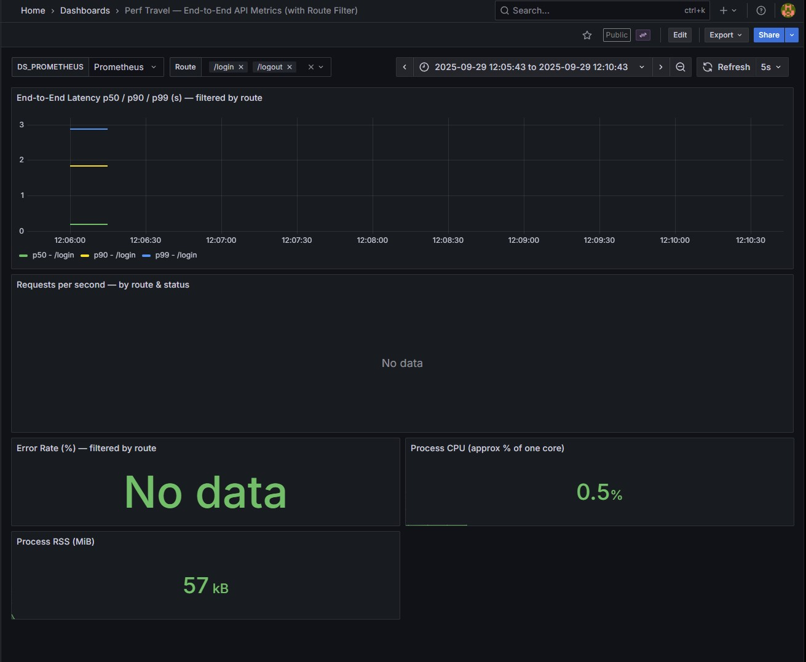
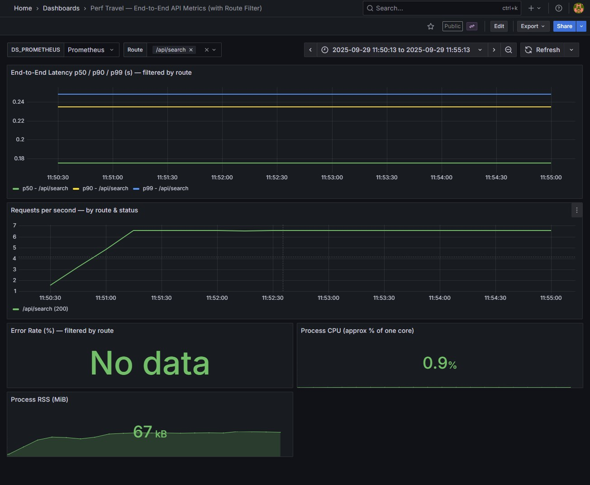
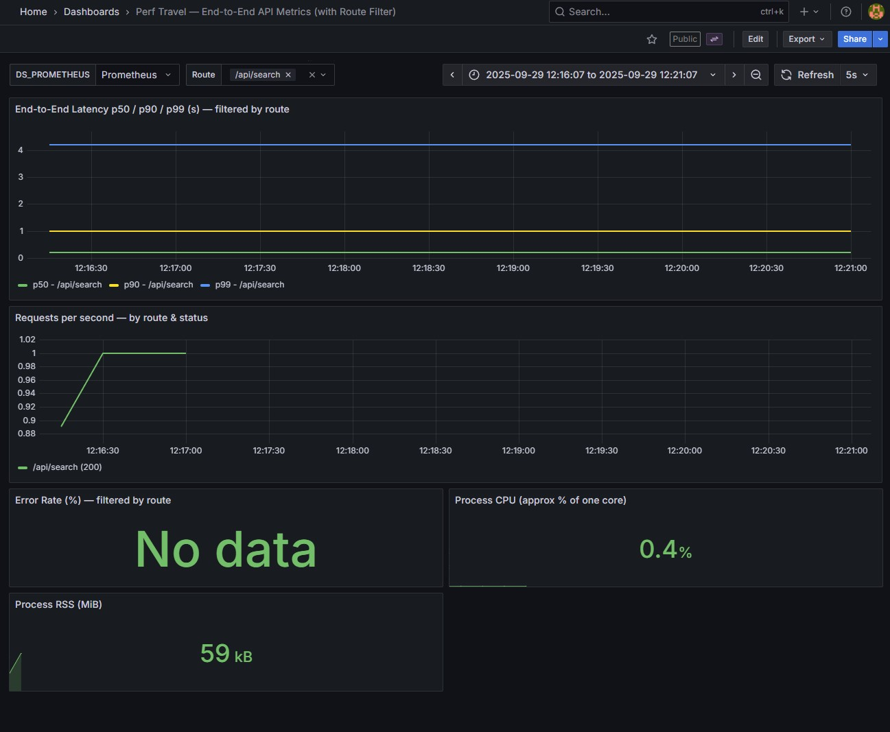

## Results Analysis

### 1. Key Findings
- 15 users showed increased response times for both login/ logout and search APIs
- Error Rate, CPU and Memory Usage OK
- ~150ms response time with 1 user for all APIs

### 2. Charts & Summary Metrics

**Login/ Logout - 1 User**
[Locust Charts (HTML Report)](./assets/locust_login_1user.html)

**Login/ Logout -15 Users**
[Locust Charts (HTML Report)](./assets/locust_login_15users.html)

**Search -1 User**
[Locust Charts (HTML Report)](./assets/locust_search_1user.html)

**Search -15 Users**
[Locust Charts (HTML Report)](./assets/locust_search_15users.html)

### 3. Identified Performance Issues
- **Login/ Logout** - Increased response time to > 5seconds with 15 concurrent users
- **Search** - Increased response time to > 8 seconds with 15 concurrent users

